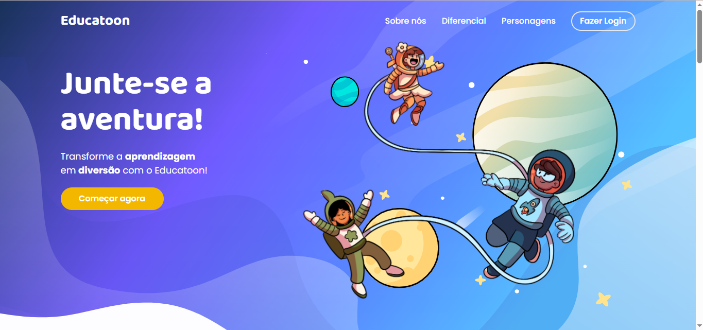
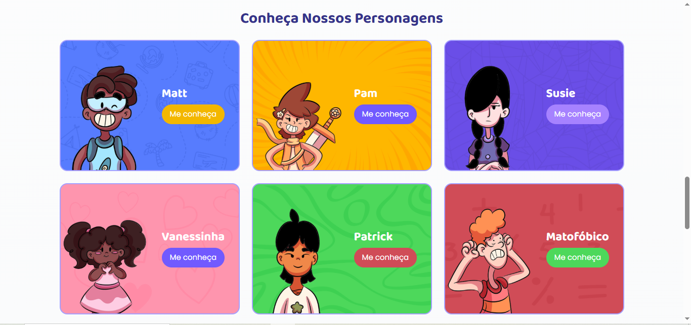
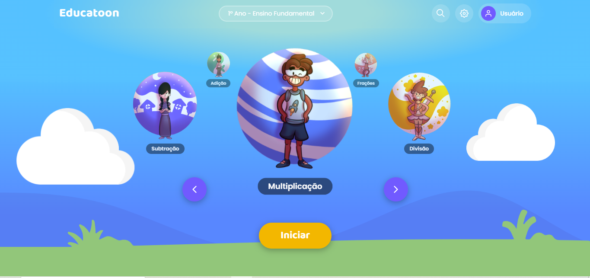
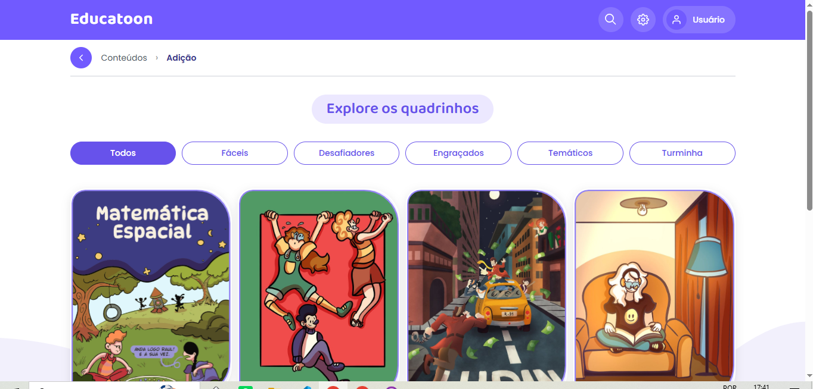

# 📘 Educatoon

> Plataforma educacional interativa baseada em histórias em quadrinhos para o ensino de matemática no Ensino Fundamental I.

---

## 🚀 Visão do Produto

O **Educatoon** é uma plataforma educacional que utiliza histórias em quadrinhos interativas como metodologia de ensino de matemática para alunos do Ensino Fundamental I.

O projeto transforma a aprendizagem em uma experiência mais lúdica, narrativa e interativa, reduzindo a percepção de dificuldade da disciplina e aumentando o engajamento dos estudantes.

---

## 🎯 Problema

O ensino de matemática nos anos iniciais frequentemente é:

- Abstrato e difícil de compreender  
- Pouco envolvente para crianças  
- Desconectado de situações reais  

Isso gera desmotivação e dificuldades no processo de aprendizagem.

---

## 💡 Solução

O Educatoon resolve esse problema através de:

- Narrativas em quadrinhos interativos  
- Integração entre história e resolução de problemas matemáticos  
- Feedback imediato com explicações pedagógicas  
- Aprendizagem baseada em decisões do usuário  

---

## 🧠 Como Funciona

1. O aluno inicia uma história em quadrinhos interativa  
2. A narrativa é interrompida por uma situação-problema matemática  
3. O aluno responde à questão:
   - ✅ Acertou → a história continua  
   - ❌ Errou → o sistema apresenta explicação e reforço do conteúdo  
4. O aluno aprende enquanto avança na narrativa  

---

## 📊 Diferenciais

- 🎮 Aprendizagem baseada em narrativa interativa  
- 🧒 Foco no Ensino Fundamental I  
- 📚 Alinhado à BNCC  
- 🧠 Feedback pedagógico imediato  
- 🎨 Interface lúdica e amigável  
- 🔄 Modelo escalável de criação de novas HQs  
- 📱 Responsivo (desktop, tablet e mobile)  

---

## 🧩 Funcionalidades

- Sistema de autenticação (login e cadastro)  
- Navegação por módulos de aprendizagem  
- Leitura de HQs interativas  
- Sistema de perguntas integradas à narrativa  
- Feedback automático com explicações  
- Acompanhamento de progresso do usuário  
- Interface responsiva e gamificada  

---

## 🛠️ Tecnologias

- React.js  
- TypeScript  
- Vite  
- CSS Modules / Styled Components  
- Bootstrap  

---

## 🧱 Arquitetura do Projeto

### 🎨 Front-end (Plataforma Web)
Responsável pela experiência do usuário:

- Interface interativa  
- Leitura das HQs  
- Sistema de perguntas  
- Autenticação  
- Navegação por módulos  

### 📚 Conteúdo Educacional (HQs)

- Histórias em quadrinhos interativas  
- Conteúdos matemáticos alinhados à BNCC  
- Estrutura narrativa com decisões do usuário  

---

## 📷 Interface da Plataforma

### Tela inicial

### Personagens

### Módulos

### Histórias em quadrinhos

---

## 👥 Equipe

### 💻 Desenvolvimento
- Marcos Patrick  
- Mateus de Aquino 

### 🎨 Ilustração e HQs
- Pamela de Castro 

### 🎨 UI/UX Design
- Vanessa Rolim 

---

## 📌 Status do Projeto

Em desenvolvimento
